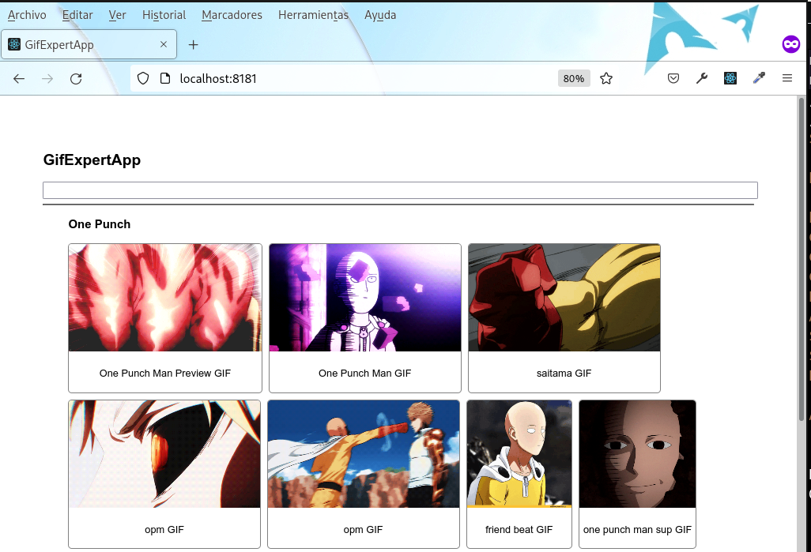

# GifExpertApp

## A small application made with React with Hooks to search and display animated gifs.




This project was bootstrapped with [Create React App](https://github.com/facebook/create-react-app).

__________________________

#### The "build" folder created during the `npm run build` command has been renamed "docs", so this folder can be used for GitHub Pages.

Once the project is uploaded to GitHub, go to the project settings, to the GitHub Pages section and configure it.

For this occasion, the project is already loaded and configured, so you can visit it from:

https://andres613.github.io/react-gifexpertapp/

## Local Starting

This app only needs [Docker Compose](https://docs.docker.com/compose/) to be deployed locally.

Can automatically deploy a local docker-compose node site using the following commands:

``` bash
# Download project
$ git clone https://github.com/andres613/react-gifexpertapp.git
$ cd react-gifexpertapp
# Build and start installation
$ docker-compose up -d
###
# If want stop and remove containers, then execute
$ docker-compose down
```
Then, open a web explorer and tipe http://localhost:3000/ in address bar to preview the project

`Note`: Before running any docker commands, make sure you have enabled the service running in the terminal:
```plain
sudo systemctl start docker.service
```

Now if you want to deploy it using a local `node` server in a `docker` container run in a terminal:

```plain
$ sudo chmod 755 runLocalServer.sh
$ ./runLocalServer.sh
$ npm install --global http-server
```
This command will place it inside the container. Once there, run:

```plain
$ cd docs
$ http-server -o
```

Then, open a web explorer and tipe http://localhost:8181/ in address bar to preview the project from locarl server.

In the terminal: Press `CTRL-C` to stop the server and then type `exit` to exit and delete the container

### The installation tool kit, provided here, include:

  - [React](https://reactjs.org/) - A JavaScript library for building user interfaces
  - [http-server](https://www.npmjs.com/package/http-server) - a simple, zero-configuration command-line static HTTP server

__________________________

## Autor

* **Andrés E. Restrepo F.** - *This project* - [
react-gifexpertapp ](https://github.com/andres613/react-gifexpertapp)
